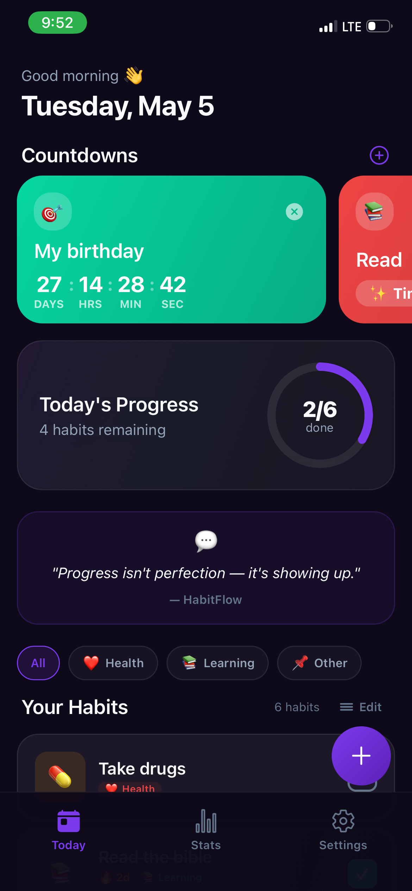
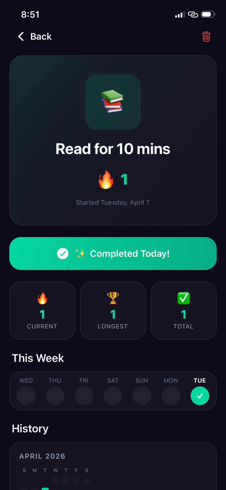
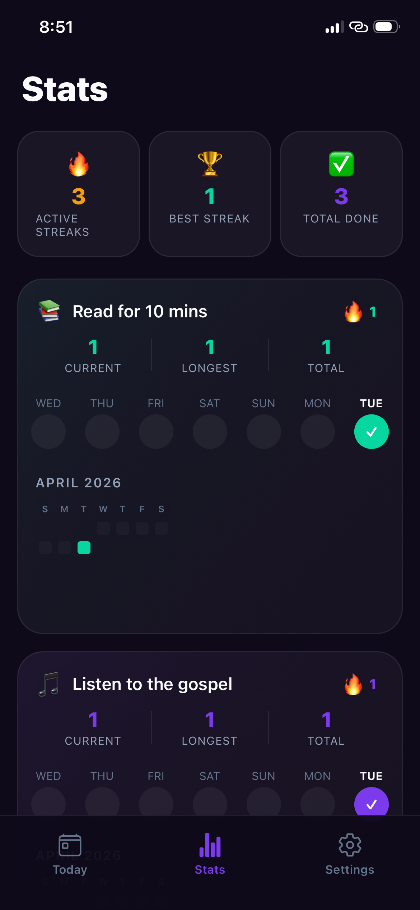
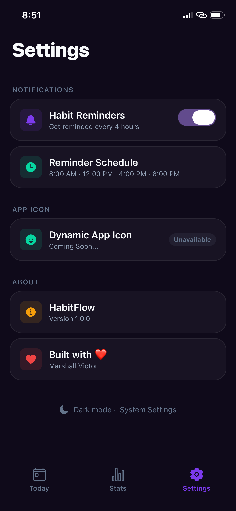

# HabitFlow

## Overview
HabitFlow is your personal companion designed to help you build and maintain positive daily routines. It gives you a clear way to track your progress, see your consistency over time, and stay motivated on your journey toward personal growth, all within an intuitive and clean interface.

## Screenshots

<div align="center">
  
  
  
  
</div>

## Features
-   **Effortless Habit Creation**: Easily set up new habits with custom names, expressive icons, and personalized colors.
-   **Intuitive Daily Tracking**: Mark habits as complete or incomplete with a simple tap, keeping your daily progress up-to-date.
-   **Real-time Streak Calculation**: See your current and longest streaks instantly, motivating you to maintain consistency.
-   **Comprehensive Progress Monitoring**: Get a clear overview of your daily completion rate and overall habit statistics.
-   **Visual Progress History**: Explore your journey with detailed calendar heatmaps and weekly overviews to spot trends and milestones.
-   **Personalized Reminders**: Stay on track with timely notifications reminding you to complete your habits throughout the day.
-   **Adaptive Theme Support**: Enjoy a comfortable viewing experience with automatic dark and light mode switching based on your device settings.
-   **Streamlined Habit Management**: Easily edit habit details or remove habits as your routine evolves.

## Getting Started
Since this is a mobile application, the "Getting Started" process involves cloning the repository, installing dependencies, and running the Expo development server.

### Installation
```bash
# Clone the repository
git clone https://github.com/Victormarshall911/Habit-app.git
cd Habit-app

# Install dependencies
npm install
# or
yarn install
```

## Usage
Once you've installed the dependencies, you can start the development server:

```bash
npm start
# or
yarn start
```

This will open an Expo development server in your browser. From there, you can:
-   Scan the QR code with your phone using the Expo Go app (iOS or Android).
-   Run on an Android emulator by pressing 'a'.
-   Run on an iOS simulator by pressing 'i' (macOS only).
-   Run in a web browser by pressing 'w'.

**Navigating the App**:
-   **Today Screen**: This is your daily dashboard. You'll see all your active habits and your progress for the current day.
    -   Tap the large add button at the bottom right to add a new habit.
    -   Tap the checkbox on any habit card to mark it as complete or incomplete for the day.
    -   Tap anywhere else on a habit card to view its detailed history and statistics.
-   **Add Habit Screen**: Here, you can define your new habit. Give it a name, pick an emoji, and choose a color.
-   **Habit Detail Screen**: Dive deep into a specific habit's performance. See its current streak, longest streak, and a visual history through weekly overviews and calendar heatmaps. You can also delete the habit from here.
-   **Stats Screen**: Get an overview of all your habits' combined statistics, including total active streaks, best streaks, and total completions across all habits.
-   **Settings Screen**: Manage app notifications and view information about the app.

## Technologies Used
| Technology | Description |
|---|---|
| [TypeScript](https://www.typescriptlang.org/) | JavaScript with syntax for types, enhancing code quality and developer experience. |
| [React Native](https://reactnative.dev/) | A framework for building native mobile applications using React. |
| [Expo](https://expo.dev/) | An open-source platform for making universal native apps with JavaScript and React. |
| [Expo Router](https://docs.expo.dev/router/introduction/) | A file-system based router built on React Navigation for universal React Native apps. |
| [Zustand](https://zustand-demo.pmnd.rs/) | A small, fast, and scalable bearbones state-management solution for React and React Native. |
| [AsyncStorage](https://react-native-async-storage.github.io/async-storage/docs/install/) | An asynchronous, persistent, key-value storage system for React Native, used for local data persistence. |
| [React Native SVG](https://github.com/react-native-svg/react-native-svg) | A library that allows rendering SVG images and shapes in React Native applications. |
| [Expo Notifications](https://docs.expo.dev/versions/latest/sdk/notifications/) | The Expo API for handling local and push notifications, used for habit reminders. |
| [Expo Haptics](https://docs.expo.dev/versions/latest/sdk/haptics/) | The Expo API for providing haptic feedback, enhancing user interaction. |
| [Expo Linear Gradient](https://docs.expo.dev/versions/latest/sdk/linear-gradient/) | Renders a native linear gradient view, used for visual flair in the UI. |

## Contributing
We welcome contributions to make HabitFlow even better! If you're looking to contribute, here's how you can get started:

1.  **Fork the repository**: Start by forking the project to your own GitHub account.
2.  **Clone your fork**:
    ```bash
    git clone https://github.com/Victormarshall911/Habit-app.git
    cd Habit-app
    ```
3.  **Create a new branch**:
    ```bash
    git checkout -b feature/your-feature-name
    ```
4.  **Make your changes**: Implement your feature or fix.
5.  **Test your changes**: Ensure everything works as expected.
6.  **Commit your changes**: Write a clear, concise commit message.
    ```bash
    git commit -m "feat: Add [brief description of feature]"
    ```
7.  **Push to your branch**:
    ```bash
    git push origin feature/your-feature-name
    ```
8.  **Open a Pull Request**: Go to the original repository on GitHub and open a pull request. Provide a detailed description of your changes.

Please ensure your code adheres to the existing style and conventions.

## License
This project is licensed under the MIT License.

## Author Info
-   **Marshall Victor**
    -   [LinkedIn](https://www.linkedin.com/in/victor-marshall)
    -   [X (formerly Twitter)](https://x.com/victormarshall)

## Badges
[](https://reactnative.dev/)
[](https://expo.dev/)
[](https://www.typescriptlang.org/)
[](https://zustand-demo.pmnd.rs/)

[](https://www.npmjs.com/package/dokugen)